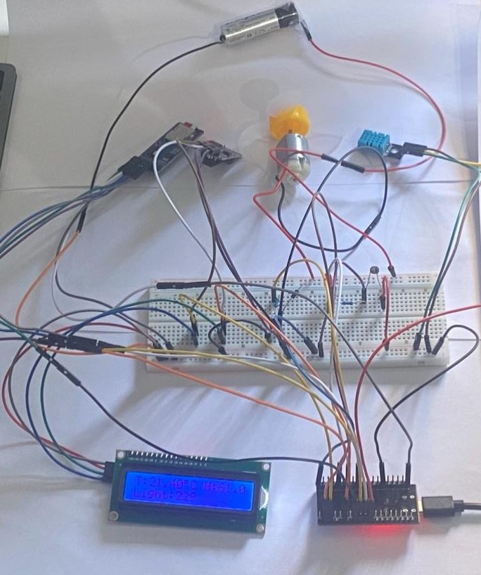
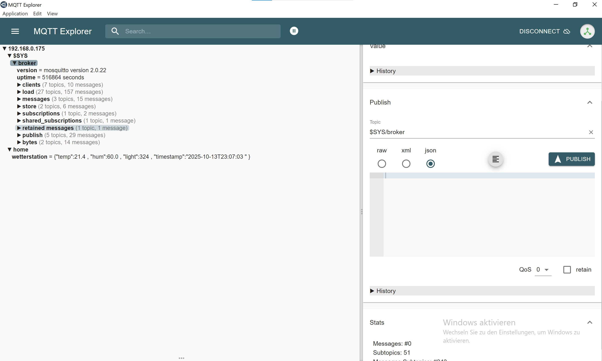

# 🌦️ ESP32 Wetterstation – Intelligentes Umweltüberwachungssystem

Diese Wetterstation (eine Erweiterung des Projekts *Mini Wetter Station*) basiert auf dem **ESP32**-Mikrocontroller und kombiniert **Umweltsensorik**, **Datenerfassung**, **Anzeige** und **Fernsteuerung** über **MQTT** und **Node-RED**.

---

## 🧩 Überblick

Die Station misst kontinuierlich:

- 🌡️ **Temperatur** und 💧 **Luftfeuchtigkeit** (DHT11)  
- 💡 **Lichtintensität** (LDR)  
- 🕒 **Datum und Uhrzeit** (RTC DS3231)  
- 💾 **Speichert Werte auf SD-Karte**  
- 📡 **Sendet Daten über MQTT** an **Node-RED Dashboard**  
- 🌀 **Steuert automatisch oder manuell** einen Lüfter (DC-Motor)

---

## ⚙️ Komponenten

| Komponente | Beschreibung |
|-------------|---------------|
| **ESP32** | Haupt-Mikrocontroller |
| **DHT11** | Temperatur- und Feuchtigkeitssensor |
| **LDR + 10 kΩ Widerstand** | Lichtmessung |
| **RTC DS3231** | Echtzeituhr über I²C |
| **LCD 16×2 (I²C)** | Anzeige von Messwerten |
| **SD-Kartenmodul** | Datenspeicherung |
| **NPN-Transistor (2N2222, BC547)** | Motorsteuerung |
| **Freilaufdiode (1N4007)** | Schutz des Transistors |
| **5 V DC-Motor** | Lüfter / Ventilator |
| **Externe 5 V-Quelle** | Motorversorgung |
| **Breadboard + Jumperkabel** | Verdrahtung |

---

## 🔌 Schaltung und Pinbelegung

### 🔧 Lüftersteuerung

| Verbindung | Beschreibung |
|-------------|---------------|
| ESP32 GPIO 25 → 1 kΩ Widerstand → Transistorbasis | Steuersignal für Transistor |
| Transistorkollektor → Motorminus (–) | Schaltet den Motorstrom |
| Motorplus (+) → 5 V-Versorgung | Motorversorgung |
| Transistoremitter → GND | Gemeinsame Masse |
| **Diode (1N4007)** | Antiparallel zum Motor (Kathode → +5 V, Anode → Motorminus) |

👉 **Wichtig:** Gemeinsame **Masse (GND)** zwischen ESP32, SD-Karte, Sensoren und externer 5-V-Versorgung herstellen!

---

### 🔌 Modul- / Sensoranschlüsse

| Modul / Sensor | Anschluss | ESP32-Pin | Beschreibung |
|----------------|------------|------------|---------------|
| **DHT11** | DATA | GPIO 17 | Temperatur & Luftfeuchtigkeit |
|  | VCC | 3.3 V | Versorgung |
|  | GND | GND | Masse |
| **LDR** | Signal (mit 10 kΩ Pull-Down) | GPIO 34 | Lichtsensor (analog) |
|  | VCC | 3.3 V | Versorgung |
|  | GND | GND | Masse |
| **LED** | Anode | GPIO 32 | Leuchtet bei Dunkelheit |
|  | Kathode | GND | Masse |
| **RTC DS3231** | SDA | GPIO 21 | I²C-Datenleitung |
|  | SCL | GPIO 22 | I²C-Takt |
|  | VCC | 3.3 V | Versorgung |
|  | GND | GND | Masse |
| **SD-Kartenmodul** | CS | GPIO 5 | SPI-Chip-Select |
|  | MOSI | GPIO 23 | SPI-Datenleitung |
|  | MISO | GPIO 19 | SPI-Empfang |
|  | SCK | GPIO 18 | SPI-Takt |
|  | VCC | 3.3 V | Versorgung |
|  | GND | GND | Masse |
| **Motorsteuerung (Transistor)** | Basis | GPIO 25 über 1 kΩ | Steuersignal |
|  | Kollektor | Motorminus (–) | Schaltet Motorstrom |
|  | Emitter | GND | Masse |
| **Freilaufdiode (1N4007)** | Kathode | +5 V | Schutz vor Rückstrom |
|  | Anode | Motorminus (–) | — |
| **DC-Motor** | + | 5 V extern | Motorversorgung |
|  | – | Transistorkollektor | Steuerung über Transistor |

---



---

## 📡 MQTT-Kommunikation

| Topic | Richtung | Beschreibung |
|--------|-----------|---------------|
| `home/wetterstation` | → Publish | Sendet Messwerte im JSON-Format |
| `home/wetterstation/fan` | ← Subscribe | Empfängt Befehle zur Lüftersteuerung |



### 📨 Nachrichtenbeispiel (JSON)

```json
{
  "temp": 26.1,
  "hum": 55.4,
  "light": 118,
  "timestamp": "2025-10-13T20:15:02"
}
```
## 🖥️ Node-RED-Dashboard

### 🧩 Benötigte Nodes

- `node-red-dashboard`  
- `node-red-node-mqtt`

---

### 📊 Widgets

| Widget | Beschreibung |
|---------|--------------|
| 🟢 **Gauge** | Temperatur |
| 🔵 **Gauge** | Luftfeuchtigkeit |
| 🟡 **Gauge** | Lichtintensität |
| ⚙️ **Switch** | Manuelle Lüftersteuerung |

---

### ⚙️ Funktionsweise

Der **Switch** sendet `ON` oder `OFF` an das Topic  
`home/wetterstation/fan`, um den Lüfter **ein- oder auszuschalten**.

---

## 💾 Datenlogging

Alle Messwerte werden in der Datei `/log.txt` auf der **SD-Karte** gespeichert, z. B.:

13/10/2025 20:10:32 | T=25.3°C H=48.7% L=120


---

## 🔍 Funktionsübersicht

| Bedingung | Aktion |
|------------|--------|
| 🌡️ Temperatur > 25 °C | Lüfter automatisch **EIN** |
| 🌡️ Temperatur < 25 °C | Lüfter automatisch **AUS** |
| ⚙️ MQTT-Nachricht `ON` | Lüfter manuell **EIN** |
| ⚙️ MQTT-Nachricht `OFF` | Lüfter manuell **AUS** |
| 💡 Licht < Grenzwert | LED **EIN** |
| 💡 Licht > Grenzwert | LED **AUS** |

---

## 📁 Projektstruktur

SmartWetterStation/
├── WetterStation_Fnl/
│ ├── WetterStation_Fnl.ino
│ ├── config.h # nicht sichtbar (sensible Daten)
│ └── config.example.h # Beispiel für eigene Konfiguration
├── .gitignore
└── README.md


---

## 🧩 Zukünftige mögliche Erweiterungen

- 🌬️ PWM-Regelung für variable Lüftergeschwindigkeit  
- 📈 Erweiterung mit BME280 (Druck, genauere Messung)  
- 🌐 Web-Interface über ESPAsyncWebServer  
- ☁️ Cloud-Integration (InfluxDB, ThingsBoard, Grafana)
