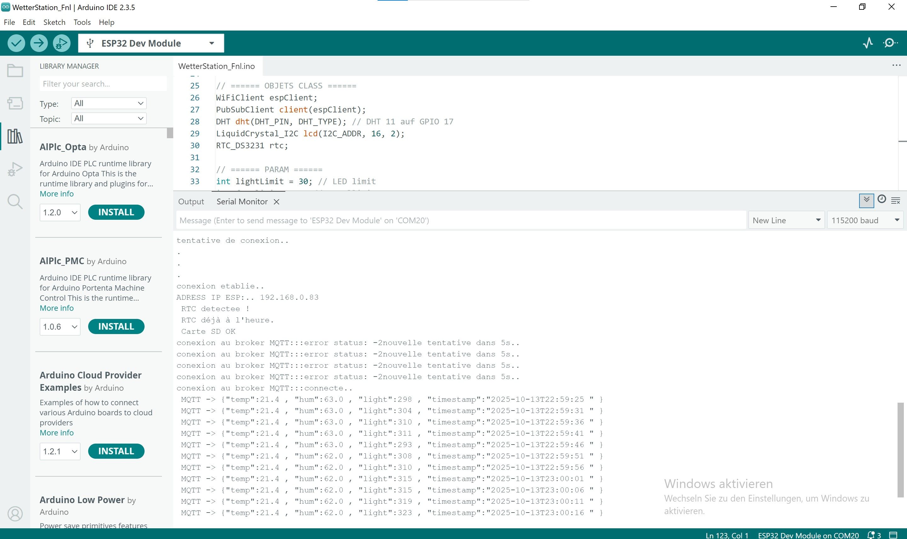
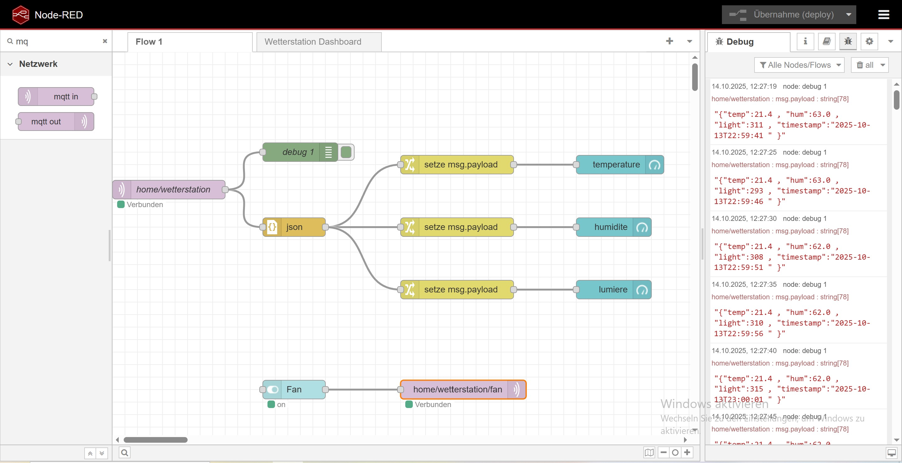
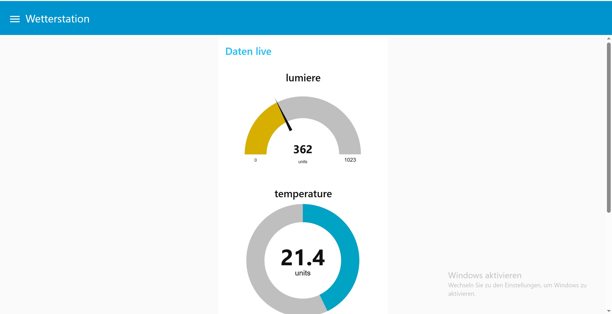

# 🌦️ ESP32 Wetterstation – Intelligentes Umweltüberwachungssystem

Diese Wetterstation (eine erweiterung von dem Projekt Mini Wetter Station) basiert auf dem **ESP32**-Mikrocontroller und kombiniert **Umweltsensorik**, **Datenerfassung**, **Anzeige** und **Fernsteuerung** über **MQTT** und **Node-RED**.

---

## 🧩 Überblick

Die Station misst kontinuierlich:
- 🌡️ Temperatur und 💧 Luftfeuchtigkeit (DHT11)
- 💡 Lichtintensität (LDR)
- 🕒 Datum und Uhrzeit (RTC DS3231)
- 💾 Speichert Werte auf SD-Karte
- 📡 Sendet Daten über MQTT an **Node-RED Dashboard**
- 🌀 Steuert automatisch oder manuell einen Lüfter (DC-Motor)

---

## ⚙️ Komponenten

| Komponente | Beschreibung |
|-------------|---------------|
| **ESP32** | Haupt-Mikrocontroller |
| **DHT11** | Temperatur- und Feuchtigkeitssensor |
| **LDR + 10 kΩ Widerstand** | Lichtmessung |
| **RTC DS3231** | Echtzeituhr über I²C |
| **LCD 16×2 (I²C)** | Anzeige von Messwerten |
| **SD-Kartenmodul** | Datenspeicherung |
| **NPN-Transistor (2N2222, BC547)** | Motorsteuerung |
| **Freilaufdiode (1N4007)** | Schutz des Transistors |
| **5 V DC-Motor** | Lüfter / Ventilator |
| **Externe 5 V-Quelle** | Motorversorgung |
| **Breadboard + Jumperkabel** | Verdrahtung |

---

## 🔌 Schaltung – Lüftersteuerung

| Verbindung | Beschreibung |
|-------------|---------------|
| ESP32 GPIO 25 → 1 kΩ Widerstand → Transistorbasis | Steuersignal für Transistor |
| Transistorkollektor → Motorminus (–) | Schaltet den Motorstrom |
| Motorplus (+) → 5 V-Versorgung | Motorversorgung |
| Transistoremitter → GND | Gemeinsame Masse |
| **Diode (1N4007)** | Antiparallel zum Motor (Kathode → +5 V, Anode → Motorminus) |

👉 **Wichtig:** Gemeinsame **Masse (GND)** zwischen ESP32, SD-Karte, Sensoren und externer 5-V-Versorgung herstellen!


---

## 📡 MQTT-Kommunikation

| Topic | Richtung | Beschreibung |
|--------|-----------|---------------|
| `home/wetterstation` | → Publish | Sendet Messwerte im JSON-Format |
| `home/wetterstation/fan` | ← Subscribe | Empfängt Befehle zur Lüftersteuerung |


### 📨 nachricht übersicht (bsp)



```json
{
  "temp": 26.1,
  "hum": 55.4,
  "light": 118,
  "timestamp": "2025-10-13T20:15:02"
}

🖥️ Node-RED-Dashboard

Benötigte Nodes:

node-red-dashboard

node-red-node-mqtt

Widgets:

Widget	Beschreibung
🟢 Gauge	Temperatur
🔵 Gauge	Luftfeuchtigkeit
🟡 Gauge	Lichtintensität
⚙️ Switch	Manuelle Lüftersteuerung

Funktionsweise:
Der Switch sendet ON oder OFF an das Topic home/wetterstation/fan, um den Lüfter ein- oder auszuschalten.

 

 

 

💾 Datenlogging

Alle Messwerte werden in /log.txt auf der SD-Karte gespeichert:

13/10/2025 20:10:32 | T=25.3°C H=48.7% L=120

🔍 Funktionsübersicht
Bedingung	Aktion
🌡️ Temperatur > 25 °C	Lüfter automatisch EIN
🌡️ Temperatur < 25 °C	Lüfter automatisch AUS
⚙️ MQTT-Nachricht „ON“	Lüfter manuell EIN
⚙️ MQTT-Nachricht „OFF“	Lüfter manuell AUS
💡 Licht < Grenzwert	LED EIN
💡 Licht > Grenzwert	LED AUS

SmartWetterStation/                
├── WetterStation_Fnl/             
│   ├── WetterStation_Fnl.ino      
│   ├── config.h                    # nicht sichtbar da sensible daten :)
│   └── config.example.h            # beispiel wie ihr config aussehen soll
├── .gitignore
└── README.md                       

🧩 Zukünftige mögliche Erweiterungen

🌬️ PWM-Regelung für variable Lüftergeschwindigkeit

📈 Erweiterung mit BME280 (Druck, genauere Messung)

🌐 Web-Interface über ESPAsyncWebServer

☁️ Cloud-Integration (InfluxDB, ThingsBoard, Grafana)
